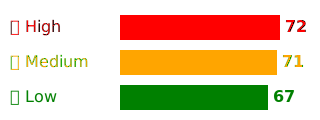

# 🎯 XP Badge: SOC Automation & Data Analytics Simulation

> ⚡ Simulates a **realistic Security Operations Center (SOC)** workflow with automated ticketing, alert escalation, and data-driven analytics—mirroring SIEM/SOAR processes and FBI-style incident review.

---

## 🔹 Project Focus

This project demonstrates **SOC automation and analyst-style decision-making**:

- 📝 **Ticketing & Alerts:** Automatically generates daily tickets and alerts.  
- 🚨 **Escalation Logic:** Classifies alerts by severity (High 🔴, Medium 🟠, Low 🟢) for prioritization.  
- 📊 **Analytics & Visualization:** Counts alerts, generates charts, and summarizes incidents.  
- 🔍 **Data-Driven Analysis:** Mirrors how SOC/IR/EDR analysts detect patterns and prioritize events.  
- 🤖 **Automation:** Fully automated via **GitHub Actions**, updating the repository daily.

---

## 🔹 Automated Daily Workflow

1. 📝 **Ticket Creation**
   - Generates a ticket with:
     - `ticket_id` 🎫  
     - System / host 🔹  
     - Severity 🔴🟠🟢  
     - Event description  
   - Stored in `tickets/YYYY-MM-DD.json`  

2. 🚨 **Alert Generation**
   - Creates a corresponding alert linked to the ticket  
   - Stored in `alerts/YYYY-MM-DD.json`  

3. 📊 **Analytics**
   - Counts alerts by severity  
   - Generates a **severity chart** (SVG/PNG)  
   - Calculates **XP points** for gamification  

4. 🖋️ **README Update**
   - Updates XP badge  
   - Updates table of **recent tickets/alerts**  
   - Embeds **severity chart** for quick analytics  

5. 🤖 **Automation**
   - **GitHub Actions** runs daily at 9AM EST or manually via workflow_dispatch  
   - Updates repository using a **PAT token**  

> This simulates a real SOC pipeline: **Ticket → Alert → Analytics → Escalation → Visualization**.

---

## 🔹 Alert Analytics

**Severity Distribution**

| Severity | Count |
|----------|-------|
| 🔴 High     | 1     |
| 🟠 Medium   | 1     |
| 🟢 Low      | 0     |

**Recent Tickets / Alerts**

| Date       | Ticket ID 🎫   | Alert ID 🚨        | Severity | Event                       |
|------------|----------------|------------------|----------|-----------------------------|
| 2026-01-07 | TICKET-2026-01-07 | ALERT-2026-01-07 | 🔴 High    | Simulated SOC event (high)  |
| 2026-01-06 | TICKET-2026-01-06 | ALERT-2026-01-06 | 🟠 Medium  | Simulated SOC event (medium)|

---

## 🔹 Chart Display

